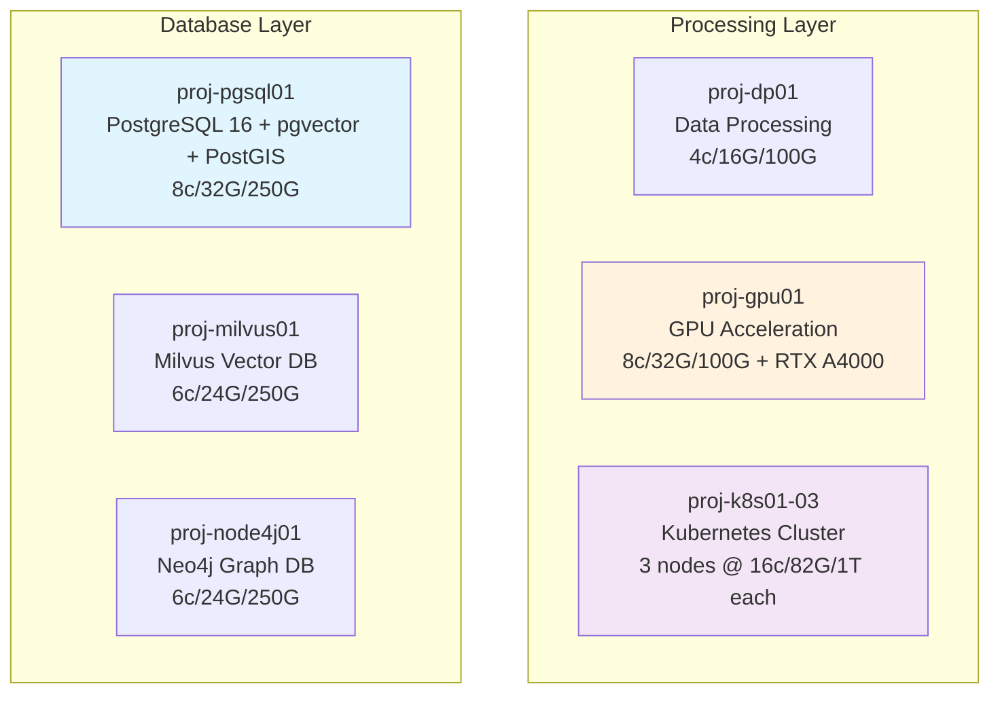

# 🛠️ Infrastructure Overview

Laboratory environment details for the VMs supporting IBM AI Engineering companion exercises.

---

## 📖 Purpose

This document covers the specific virtual machines and their roles in supporting AI/ML workloads for the companion exercises. Each VM is optimized for particular functions within the AI/ML pipeline.

---

## 🗄️ proj-pgsql01: Primary Database Server

This VM runs PostgreSQL 16 and serves as our primary 'big data' database workhorse. Tuned specifically for large-scale data operations, it handles both the Steam dataset (239K applications) and DESI astronomical data (6.4M galaxy records) with impressive performance - we can validate the entire 6.4M record DESI dataset in around 10 seconds.

**Configuration:** 8 vCPU, 32GB RAM, 250GB NVMe (node06)

**Key Capabilities:**

- PostgreSQL 16 with pgvector extension for semantic search operations
- PostGIS extension for astronomical coordinate transformations
- Multi-modal database architecture supporting relational, document, and vector data types
- Complex analytical queries completing in <500ms average response time

---

## 💻 proj-dp01: Data Processing Platform

This is our general-purpose analysis platform that handles the computational work that doesn't need GPU acceleration. It's where most of the data preprocessing, feature engineering, and statistical analysis happens before models get trained on the GPU.

**Configuration:** 4 vCPU, 16GB RAM, 100GB NVMe (node07)

**Primary Functions:**

- Jupyter notebook environments for exploratory data analysis
- Feature engineering and data preprocessing workflows
- Statistical computations and model evaluation tasks
- Pipeline orchestration between database and specialized processing VMs

---

## 🧠 proj-gpu01: GPU Acceleration Server

This VM provides the CUDA-powered acceleration for deep learning training and inference. The RTX A4000 gives us substantial speedup for neural network operations - what might take hours on CPU can often complete in minutes here.

**Configuration:** 8 vCPU, 32GB RAM, 100GB NVMe with NVIDIA RTX A4000 (node07)

**AI/ML Applications:**

- Deep learning model training with TensorFlow and PyTorch
- Computer vision tasks including CNN architectures
- Neural network inference for production deployment examples
- GPU utilization monitoring and performance optimization demonstrations

---

## 🔍 proj-milvus01: Standalone Vector Database

While pgvector handles most of our vector operations, this dedicated Milvus instance provides capabilities for large-scale vector similarity operations that go beyond what we can do in PostgreSQL. It's particularly useful for exercises involving massive embedding collections or specialized vector search patterns.

**Configuration:** 6 vCPU, 24GB RAM, 250GB NVMe (node07)

**Specialized Functions:**

- Large-scale vector similarity search operations
- Advanced embedding storage and retrieval patterns
- Benchmarking vector database performance compared to pgvector
- Extended vector search experiments and methodology development

---

## 🕸️ proj-node4j01: Graph Database Platform

This VM runs Neo4j for relationship analysis and graph-based machine learning applications. It's particularly valuable for the Steam dataset where we can analyze developer networks, publisher relationships, and game recommendation graphs.

**Configuration:** 6 vCPU, 24GB RAM, 250GB NVMe (node06)

**Graph Applications:**

- Developer and publisher relationship mapping from Steam data
- Network analysis and community detection algorithms
- Graph-based recommendation system development
- Social network analysis patterns in gaming ecosystems

---

## 🚀 proj-k8s01-03: Container Platform

Our three-node Kubernetes cluster handles production deployment patterns and MLOps demonstrations. This is where we deploy trained models as microservices and show complete CI/CD pipelines for machine learning applications. With 48 total vCPUs and 246GB RAM across the cluster, it provides substantial resources for container workloads.

**Configuration:** 16 vCPU, 82GB RAM, 1TB NVMe each (nodes 01, 03, 04)

**Deployment Capabilities:**

- Model serving containers with automated scaling
- Complete MLOps workflow demonstrations
- Microservice architecture for AI applications
- Production monitoring and observability patterns

---

## 📊 Infrastructure Architecture

## 📊 Infrastructure Philosophy

Each VM serves a specific purpose rather than trying to be a general-purpose development environment. This mirrors production patterns where databases, processing, and specialized workloads run on dedicated infrastructure. The setup allows us to demonstrate realistic performance characteristics and deployment patterns that students would encounter in enterprise environments.
